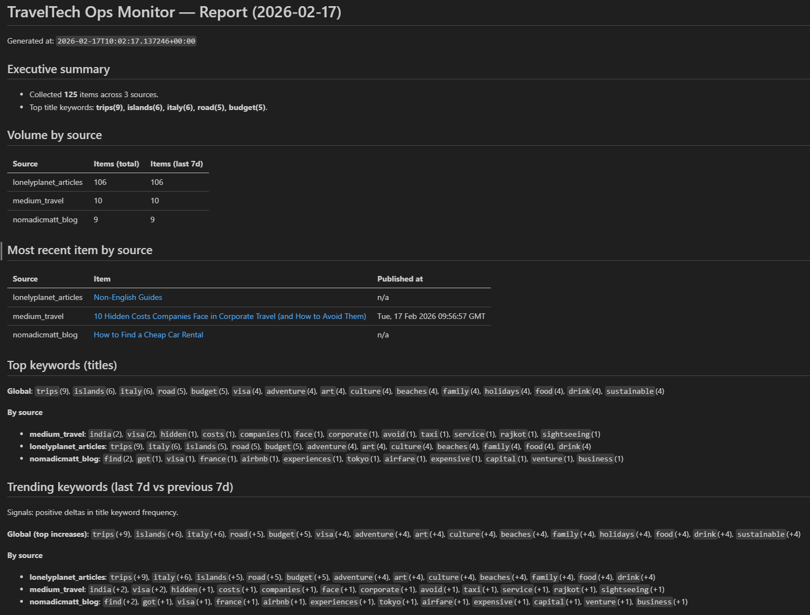
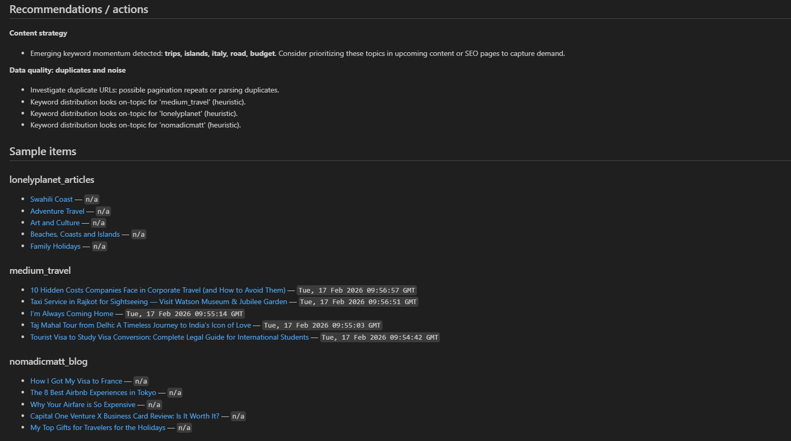
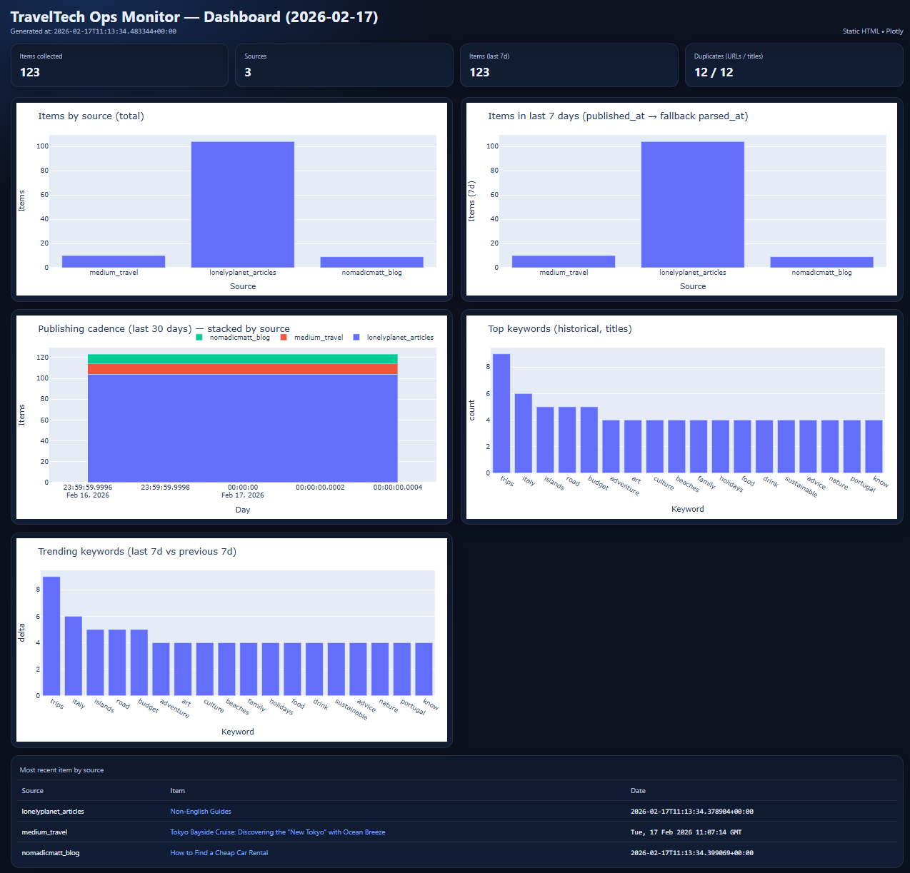

Author: Cristian Alemán Suárez

# TravelTech Ops Monitor

## Overview

This project showcases an end-to-end, operations-oriented data pipeline designed to monitor public travel-related content and transform heterogeneous signals into actionable insights.

The system is tailored for **TravelTech product, content, and operations teams** that need recurring, lightweight monitoring to support editorial planning, trend detection, and strategic decision-making.

---

## Why This Project

Rather than focusing on predictive modeling, this project emphasizes:

- Building **reproducible data pipelines**
- Designing **operational metrics** aligned with real decisions
- Handling **incomplete and heterogeneous public data**
- Producing **interpretable insights**, not just raw analytics

It reflects the kind of systems commonly found in product analytics, content intelligence, and data operations roles.

---

## Objective

The goal is to automatically monitor travel-related trends from public content sources, normalize the data, compute meaningful operational signals, and generate recurring reports and dashboards.

Typical decisions supported include:
- Identifying emerging destinations or topics
- Detecting saturated vs underexplored content areas
- Understanding publishing cadence and focus across sources
- Spotting short-term keyword momentum and potential content gaps

---

## Architecture & Pipeline

The pipeline follows a simple, reproducible flow:

1. **Data collection**  
   Public content sources are queried via `fetch.py`.  
   Raw HTML / RSS data is stored in `data/raw/` for traceability.

2. **Normalization & parsing**  
   `parse.py` converts heterogeneous inputs (RSS + HTML) into a unified JSONL schema.  
   Processed data is stored in `data/processed/`.

3. **Metrics computation**  
   `metrics.py` computes operational signals, including:
   - **Source volume**: total items, items per source  
   - **Freshness / recency**: last 7 days, most recent item per source  
   - **Publishing cadence**: daily volume over the last 30 days  
   - **Topics**: top keywords in titles (global and per source)  
   - **Trending keywords**: week-over-week keyword deltas  
   - **Data quality**: duplicated URLs and titles (syndication signals)

4. **Automated reporting**  
   `report.py` generates a markdown report with summaries, tables, and recommendations.  
   Reports are stored in `reports/`.

5. **Automated dashboard**  
   `dashboard.py` produces a static HTML dashboard with:
   - Post volume by source  
   - Publishing cadence (last 30 days)  
   - Top and trending keywords  
   Dashboards are stored in `reports/`.

---

## How to Run

It is recommended to use a virtual environment.

```bash
python -m venv .venv
```

Activate it:
```bash
source .venv/bin/activate   # macOS / Linux
.venv\Scripts\activate      # Windows
```

Install dependencies:
```bash
pip install -r requirements.txt
```

Run the full pipeline:
```bash
python run_weekly.py
```

This executes the complete workflow from data collection to reporting and dashboard generation.

## Limitations & Future Improvements

- The pipeline currently runs manually and simulates a weekly cadence.
- Scheduling (cron / task scheduler) is not yet implemented.
- Engagement metrics are inferred from public signals and do not include private analytics.
- Raw data snapshots are overwritten; historical accumulation would enable stronger time-series analysis.
- Cadence and trend signals strengthen as data accumulates across multiple runs.

Despite these limitations, the system already automates most of the monitoring workflow and serves as a solid proof of concept for an operations-focused monitoring tool.


## Output examples

### Automated Report




### Dashboard


## License
MIT License